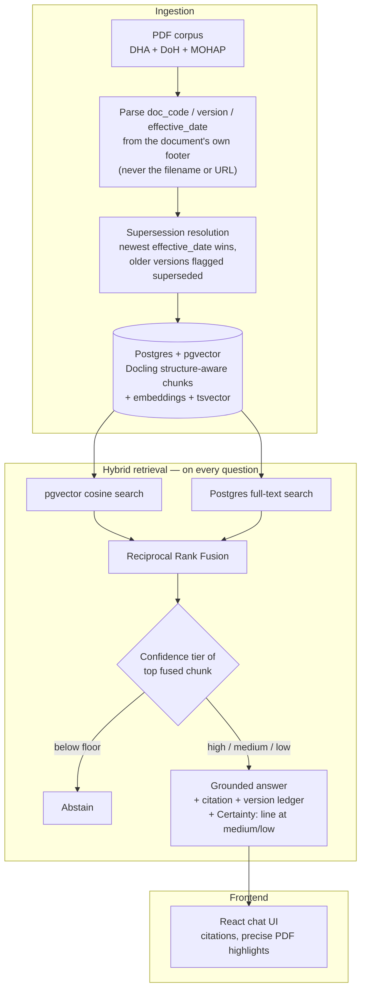

# ReguLense

**Hybrid-retrieval Q&A over UAE health regulation — with version awareness, jurisdiction filtering, tiered confidence, and mandatory citation-or-abstain.**

[](https://github.com/haitham72/NeoHealth/actions/workflows/deploy.yml)
[](LICENSE)

**Live demo:** https://neohealth-gpzo.onrender.com

<!-- TODO: docs/screenshots/*.png predate both the RegLens → ReguLense rebrand and the chat-UI
     redesign — they still show the old "REGLENS" wordmark and the old single-page layout, not
     the current chat interface. Regenerate against the live app before using them here. -->

ReguLense answers questions about DHA, DoH, and MOHAP (federal) regulation with a mandatory citation (document, code, version, effective date, page), automatically excludes superseded regulations from retrieval, can restrict retrieval to a single jurisdiction, and refuses to answer rather than guess when it isn't confident — or answers with an explicit certainty caveat when confidence is real but weaker than usual. It exists because standard RAG has no concept of a document going out of force, or of jurisdiction — and in regulated compliance work, a confident answer built on a superseded or wrong-jurisdiction regulation is the expensive failure mode.

## The problem, concretely

DHA has published three versions of the same licensing manual (`DHA/HRS/HLD/MA-2`) — 2022, May 2025, and July 2025 — all still sitting on their public site. Ask a standard RAG system a licensing question and it will happily cite whichever version's text is the closest embedding match, with no indication that two of the three are dead. ReguLense tracks effective dates, marks every version but the newest as superseded, and excludes them from retrieval by default.

| | Plain RAG | ReguLense |
|---|---|---|
| Citation | Whatever ranks highest | Filtered to in-force only |
| Version awareness | None | Explicit — shows the full version ledger |
| Jurisdiction awareness | None | Optional hard filter to DHA / DoH / MOHAP |
| Below-confidence question | Answers anyway | Abstains: *"I don't have current guidance on that"* |
| Weak-but-real match | Answers as if certain | Answers, with an explicit certainty caveat |

## How it works



## What it demonstrates

- **Supersession-aware retrieval** — a single boolean (`superseded`) drives the entire safety property; toggle it off in the UI to see the exact naive-RAG failure mode side by side with the correct answer.
- **Jurisdiction-aware retrieval** — documents carry their issuing authority (DHA / DoH / MOHAP); an optional filter prevents a Dubai-context question from silently getting grounded in an Abu Dhabi regulation or vice versa.
- **Bilingual hybrid search** — pgvector semantic search + Postgres full-text (English and Arabic tsvector) fused with RRF, so an English query can still surface an Arabic source passage.
- **Tiered confidence, not a binary** — below a calibrated floor the system declines rather than fabricates; above it but still weaker than usual, it answers with an explicit in-text certainty caveat instead of presenting a shaky match with the same confidence as a strong one.
- **Metadata parsed from source, not filenames** — one PDF in the corpus lives at a URL suggesting a 2023 document; the file itself is Issue 4, effective November 2025. ReguLense parses the document's own printed metadata, never the URL path.
- **On-demand version comparison** — once an answer cites a document with an earlier version, a "See what changed" button sends the model the full text of both versions and explains the actual difference in plain language, scoped to the question that was asked.
- **Precise PDF citation highlighting** — chunking is structure-aware (Docling: real headers/sections, not arbitrary page splits), and each chunk's exact bounding box is stored at ingest time, so "View in PDF" highlights the complete cited passage precisely — not a fuzzy, fixed-size window guessed from word overlap with the generated answer.
- **Optional local-only generation** — answer generation can run fully on-machine via LM Studio's OpenAI-compatible server instead of OpenAI, for privacy-sensitive local development (retrieval/embeddings stay on OpenAI regardless; see `ARCHITECTURE.md`).

## Tech stack

| Layer | Choice |
|---|---|
| Corpus | 34 DHA/DoH/MOHAP regulatory PDFs + 3 research papers, ~800 structure-aware chunks |
| Chunking | Docling (`HybridChunker` + a merge/re-split pass — see `backend/ingestion/rechunk.py`) |
| Storage | Postgres 16 + pgvector (Supabase) |
| Embeddings | OpenAI `text-embedding-3-small` (1536-dim) |
| Generation | OpenAI `gpt-4o-mini` primary, with an automatic NaraRouter fallback (rate limit or outage) and an optional local LM Studio model — temperature 0, strictly grounded in retrieved chunks |
| Backend | FastAPI (`backend/app/`), public with IP-based rate limiting (no auth) |
| Frontend | React 19 + TypeScript + Vite + Tailwind v4 |
| Containers / deploy | Docker + docker-compose (local), single Render web service (production) |

## Running it

One command, no local Python/Node setup:

```bash
cp backend/.env.example backend/.env   # fill in OPENAI_API_KEY at minimum
docker compose up --build
```

Frontend at `http://localhost:8080`, API at `http://localhost:8000`. See [`RUN.md`](RUN.md) for the full manual (non-Docker) setup, environment variables, a from-scratch corpus rebuild, and troubleshooting.

For a full technical walkthrough of the retrieval algorithm, schema, and the reasoning behind every non-obvious design decision, see [`ARCHITECTURE.md`](ARCHITECTURE.md).

## License

MIT — see [`LICENSE`](LICENSE).
